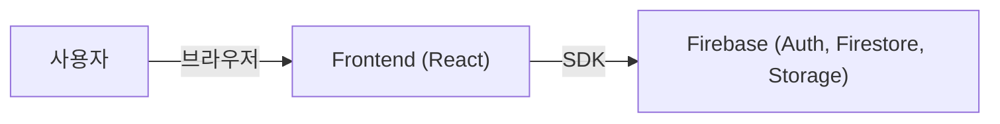

# 시스템 설계서 (System Design Document)

## 1. 아키텍처 개요
**AdvanceKeep**은 클라이언트-서버 구조를 기반으로 하는 웹 애플리케이션입니다. Firebase를 백엔드로 활용하여 실시간 데이터 동기화와 서버리스 아키텍처를 구현하고 있습니다.

### 시스템 구성도


## 2. 프론트엔드 설계 (Frontend)

### 2.1 기술 스택
-   **Framework**: React 18
-   **Build Tool**: Vite
-   **Language**: JavaScript (ES6+)
-   **State Management**: React Context API & Custom Hooks (Optimistic Updates 적용)
-   **Routing**: React Router v7
-   **Performance**: `React.lazy` (Code Splitting), `manualChunks` (Vendor Splitting)

### 2.2 디렉토리 구조
프로젝트는 기능과 역할에 따라 다음과 같이 모듈화된 구조를 따릅니다.

-   `src/components`: UI 컴포넌트 (Common, Features, Layout)
-   `src/pages`: 라우트별 페이지 (Home, Archive, Trash)
-   `src/hooks`: 비지니스 로직 및 상태 관리 (useNotes, useAuth 등)
-   `src/services`: API 및 Firebase 통신 계층 (api.js, auth.js, backupService.js)
-   `src/utils`: 공통 유틸리티 함수 및 헬퍼

### 2.3 주요 컴포넌트 설계
-   **NoteForm**: 메모 작성 폼. 커스텀 컬러 피커를 포함하며 이미지 업로드 및 배경색 지정을 담당.
-   **NoteCard**: 개별 메모 표시. 배경색(`color`) 필드에 따른 동적 스타일링 적용.
-   **EditNoteModal**: 메모 수정 모달. 실시간 배경색 프리뷰 및 데이터 업데이트 처리.
-   **ChecklistInputItem**: 체크리스트 항목의 입력, 삭제, 완료 처리를 담당하는 재사용 가능한 컴포넌트.
-   **Layout**: 사이드바, 헤더 등 공통 레이아웃 요소 관리 (`CloudMenu` 포함).
-   **Backup/RestoreModal**: 로컬 파일 백업 및 복구를 위한 모달 UI.

## 3. 백엔드 설계 (Backend - Serverless)

### 3.1 기술 스택
-   **Platform**: Firebase
-   **Database**: Cloud Firestore (NoSQL)
-   **Authentication**: Firebase Authentication
    -   이메일/비밀번호 인증
    -   Google OAuth 2.0 소셜 로그인
    -   세션 지속성 옵션 (Local/Session Persistence)
-   **Storage**: Firebase Cloud Storage (이미지 호스팅)

### 3.2 데이터 스키마 (Firestore Collection: `notes`)
`notes` 컬렉션의 문서는 다음과 같은 필드를 가집니다:
```json
{
  "id": "string (UUID v4 / Firestore ID)",
  "userId": "string (구 소유자 ID)",
  "ownerId": "string (명시적 소유자 ID)",
  "title": "string",
  "type": "string ('text' | 'checklist')",
  "text": "string (Markdown/RichText - type이 text일 때)",
  "items": [{ "id": "string", "text": "string", "checked": boolean }],
  "images": ["url1", "url2"],
  "image": "string (첫 번째 이미지 URL - 호환용)",
  "color": "string (Hex code, default: #ffffff)",
  "labels": ["string (Label ID)"],
  "isPinned": boolean,
  "isArchived": boolean,
  "inTrash": boolean,
  "sharedWith": ["userId1", "userId2"],
  "createdAt": "ISO 8601 string",
  "updatedAt": "ISO 8601 string"
}
```

## 4. 스타일링 및 레이아웃
-   **Vanilla CSS**: 전역 스타일 및 변수(`--bg-primary` 등) 관리.
-   **Flexbox**: `action-tools` 그룹화 및 `margin-right: auto`를 활용한 동적 레이아웃 배치.
-   **Grid**: 커스텀 컬러 피커 팔레트(`grid-template-columns`)에 활용.
-   **Masonry**: `column-width`를 활용한 다중 열 그리드 레이아웃.

## 5. 실행 환경
-   `npm start`: 프론트엔드 개발 서버(Vite)를 구동합니다.
-   **Real-time**: Firebase SDK의 `onSnapshot` 리스너를 통해 별도의 API 요청 없이 실시간 데이터 동기화가 이루어집니다.
