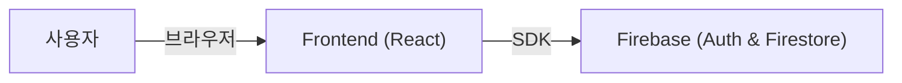

# 시스템 설계서 (System Design Document)

## 1. 아키텍처 개요
**AdvanceKeep**은 클라이언트-서버 구조를 기반으로 하는 웹 애플리케이션입니다. 현재 단계에서는 빠른 프로토타이핑과 개발을 위해 Mock Backend를 사용하고 있습니다.

### 시스템 구성도


## 2. 프론트엔드 설계 (Frontend)

### 2.1 기술 스택
-   **Framework**: React 18
-   **Build Tool**: Vite
-   **Language**: JavaScript (ES6+)
-   **State Management**: React Context API & Custom Hooks
-   **Routing**: React Router v7

### 2.2 디렉토리 구조
프로젝트는 기능과 역할에 따라 다음과 같이 모듈화된 구조를 따릅니다.

-   `src/components`: UI 컴포넌트 (Common, Features, Layout)
-   `src/pages`: 라우트별 페이지 (Home, Archive, Trash)
-   `src/hooks`: 비즈니스 로직 및 상태 관리 (useNotes 등)
-   `src/services`: API 통신 계층
-   `src/utils`: 공통 유틸리티 함수

### 2.3 주요 컴포넌트 설계
-   **App**: 최상위 컴포넌트, 라우팅 및 전역 레이아웃 관리
-   **NoteCard**: 개별 메모 표시, 이미지 렌더링, 호버 액션 처리
-   **InputArea**: 새로운 메모 작성 및 이미지 업로드 처리
-   **MasonryLayout**: 핀터레스트 스타일의 그리드 레이아웃 구현

## 3. 백엔드 설계 (Backend - Serverless)

### 3.1 기술 스택
-   **Platform**: Firebase
-   **Database**: Cloud Firestore (NoSQL)
-   **Authentication**: Firebase Authentication

### 3.2 데이터 스키마 (Firestore Collection: `notes`)
`notes` 컬렉션의 문서는 다음과 같은 필드를 가집니다:
```json
{
  "id": "string (Auto ID)",
  "uid": "string (User ID)",
  "title": "string",
  "content": "string",
  "images": ["url1", "url2"],
  "isPinned": boolean,
  "isArchived": boolean,
  "isTrashed": boolean,
  "createdAt": "timestamp",
  "updatedAt": "timestamp"
}
```
**참고**: `users` 컬렉션은 Firebase Auth로 대체되지만, 추가 사용자 정보가 필요한 경우 별도 컬렉션으로 관리할 수 있습니다.

## 4. 인터페이스 설계
-   **API 통신**: `axios` 또는 `fetch`를 사용하여 RESTful API 호출
-   **스타일링**: CSS Modules를 사용하여 컴포넌트별 스코프 지정

## 5. 실행 환경
-   `npm run dev` 명령어를 통해 프론트엔드 개발 서버를 구동합니다.
-   백엔드는 Firebase 클라우드 서비스를 직접 이용합니다.
